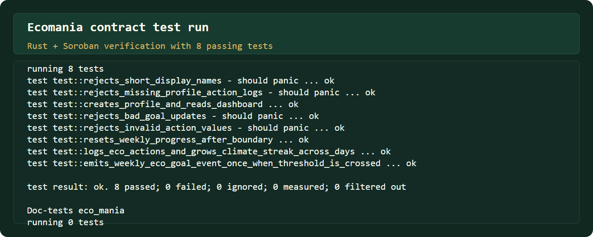

# Ecomania

[](https://github.com/georgiandeep25-prog/Ecomania/actions/workflows/ci-cd.yml)

Ecomania is a Stellar Soroban mini-dApp for on-chain sustainability action tracking. Users connect a Freighter wallet, create a public eco profile, set a weekly eco-action goal, log planet-positive actions, build a climate-positive streak across days, and browse a live public activity feed sourced from recent Soroban contract events.

Live app: `https://ecomania-five.vercel.app`

## Overview

Ecomania keeps the original full-stack Soroban + React architecture and converts the product domain into a sustainability tracker:

- Wallet-backed eco profiles stored on Soroban
- Weekly eco-action goals with validation and update flows
- On-chain action logging for recycling, public transport, tree planting, energy saving, water saving, composting, reusable bags, bike rides, and custom action labels
- Climate-positive streak tracking across consecutive action days
- Weekly progress reset logic based on ledger time
- Weekly eco goal milestone event emitted once when a user crosses the threshold
- Public activity feed powered by Soroban RPC `getEvents`
- Responsive React interface that remains useful without a wallet connection

## Architecture

```text
contracts/eco_mania/        Soroban smart contract
frontend/                   React + Vite frontend
frontend/src/lib/           Contract client helpers and event normalization
scripts/                    Stellar deploy and frontend config export scripts
deployments/                Network deployment records
.github/workflows/          CI/CD workflow
```

## Soroban Contract

Contract package: `eco_mania`

Contract type: `Ecomania`

Primary data structures:

- `EcoProfile`
- `EcoAction`
- `EcoDashboard`

Methods:

- `save_profile(eco_user, display_name, weekly_goal_actions)`
- `update_weekly_goal(eco_user, new_goal_actions)`
- `log_eco_action(eco_user, action_type, action_quantity)`
- `get_dashboard(eco_user)`
- `get_action_count(eco_user)`
- `get_action(eco_user, index)`
- `has_profile(eco_user)`

Events:

- `profile_saved`
- `weekly_goal_updated`
- `eco_action_logged`
- `weekly_eco_goal_reached`

Validation defaults:

- Display name: 3-32 characters
- Eco action type: 3-48 characters
- Action quantity: 1-100
- Weekly eco goal: 1-500 actions

## Frontend

The frontend is a React + Vite app with:

- Freighter wallet connection and network checks
- React Query reads, cache invalidation, and polling
- Soroban contract writes through `@stellar/stellar-sdk`
- Public contract event feed that works before wallet connection
- Eco profile, weekly goal, action log, dashboard metrics, and recent wallet activity views
- Explorer links for contract and transaction inspection

Dashboard metrics:

- Eco actions logged
- This week
- Climate streak
- Profile name

## Local Setup

Install dependencies:

```powershell
npm install
```

Configure `.env` from `.env.example`:

```env
STELLAR_ACCOUNT=alice
STELLAR_NETWORK=testnet
STELLAR_CONTRACT_ALIAS=eco_mania
VITE_STELLAR_RPC_URL=https://soroban-testnet.stellar.org
VITE_STELLAR_NETWORK_PASSPHRASE=Test SDF Network ; September 2015
VITE_CONTRACT_ID=CC3I3RHEQ6OOHYWYXUPUUGFOU4MRJEGEIFULJ4UJ3EUE5FATDBAHQ3TM
```

Start the frontend:

```powershell
npm run dev
```

Open the Vite URL, connect Freighter, and use Stellar Testnet.

## Build And Verify

Run contract tests:

```powershell
npm run contract:test
```

Build the contract wasm directly:

```powershell
npm run contract:wasm
```

Build with Stellar CLI:

```powershell
npm run contract:build
```

Lint the frontend:

```powershell
npm run lint
```

Build the frontend:

```powershell
npm run build:frontend
```

## Stellar Deployment

Generate and fund a Stellar CLI identity if needed:

```powershell
stellar keys generate alice --network testnet --fund
```

Deploy the contract:

```powershell
npm run contract:build
npm run contract:deploy
```

The deploy script writes `deployments/testnet.json` with:

- `contractName`
- `contractId`
- `network`
- `sourceAccount`
- `alias`
- `deployedAt`

Export the contract ID into the frontend fallback config:

```powershell
npm run export:frontend
```

For hosted environments, set `VITE_CONTRACT_ID`, `VITE_STELLAR_RPC_URL`, and `VITE_STELLAR_NETWORK_PASSPHRASE`.

Current testnet contract:

- Contract ID: `CC3I3RHEQ6OOHYWYXUPUUGFOU4MRJEGEIFULJ4UJ3EUE5FATDBAHQ3TM`
- Contract alias: `eco_mania`
- Source identity: `alice`
- WASM hash: `2cdc4c6ede278398704ff4c28bb51b5429a103c47b14c742cef33dbe3a1bcc4f`
- Deploy transaction: `4d47c7f0ecdd2c0f0ce379c2386690acfc2f945b18a0c1f1ccda0b1dce19c754`
- Deployed at: `2026-04-29T15:26:26.144Z`
- Contract explorer: `https://lab.stellar.org/r/testnet/contract/CC3I3RHEQ6OOHYWYXUPUUGFOU4MRJEGEIFULJ4UJ3EUE5FATDBAHQ3TM`
- Transaction explorer: `https://stellar.expert/explorer/testnet/tx/4d47c7f0ecdd2c0f0ce379c2386690acfc2f945b18a0c1f1ccda0b1dce19c754`

## Vercel Deployment

This repository is configured for a root Vercel project:

- Install command: `npm install`
- Build command: `npm run build:frontend`
- Output directory: `frontend/dist`

Create a new Vercel project for Ecomania and do not link it to any previous project. Required GitHub Actions secrets for production deploys:

- `VERCEL_ORG_ID`
- `VERCEL_PROJECT_ID`
- `VERCEL_TOKEN`

Current Vercel production URL: `https://ecomania-five.vercel.app`

The deploy job uses:

```powershell
npx --yes vercel@latest pull --yes --environment=production --token=$VERCEL_TOKEN
npx --yes vercel@latest build --prod --token=$VERCEL_TOKEN
npx --yes vercel@latest deploy --prebuilt --prod --token=$VERCEL_TOKEN
```

## CI/CD

Workflow file: [.github/workflows/ci-cd.yml](./.github/workflows/ci-cd.yml)

Live workflow runs: [GitHub Actions for Ecomania](https://github.com/georgiandeep25-prog/Ecomania/actions/workflows/ci-cd.yml)

The `CI/CD` workflow runs on:

- Pushes to `main`
- Pull requests
- Manual dispatch

The quality job performs:

- Checkout
- Rust toolchain setup with `wasm32v1-none`
- Node.js setup
- `npm ci`
- Soroban/Rust contract tests
- Contract wasm build
- Frontend lint
- Frontend production build

The deploy job runs only on pushes to `main` and defines:

```yaml
environment:
  name: production
  url: https://ecomania-five.vercel.app
```

After a successful main-branch workflow run, GitHub should show the repository sidebar section `Deployments -> production`.

## Usage Flow

1. Open the Ecomania frontend.
2. Confirm the public Soroban activity feed loads without connecting a wallet.
3. Connect Freighter on Stellar Testnet.
4. Create or update an eco profile.
5. Set a weekly eco-action goal.
6. Log an eco action such as Recycling, Public Transport, Energy Saving, Water Saving, Composting, Reusable Bag, Tree Planting, or Bike Ride.
7. Confirm the dashboard updates, the recent action list refreshes, and the public event feed shows the new contract event.
8. Use the transaction link to inspect the write on Stellar Expert.

## Demo Video

Watch the Ecomania demo video:

https://drive.google.com/file/d/1fyh44vwBPg8KkTM3u7AbpuhR0Jc8XqEj/view?usp=sharing

## Screenshots

### Desktop Impact Console


### Mobile Responsive View


### GitHub Actions CI/CD


### Contract Test Verification



## Verification Checklist

- Contract tests pass
- Contract wasm builds
- Frontend lint passes
- Frontend production build passes
- `.github/workflows/ci-cd.yml` exists
- Workflow deploy job defines the `production` environment
- README badge points to `.github/workflows/ci-cd.yml`
- README links to live workflow runs
- GitHub Deployments instructions are documented
- No legacy product-domain terms remain in source/docs

## Notes

- Freighter is required for user-submitted writes.
- The public contract feed can render before wallet connection.
- This workspace is ready to commit and push manually to `https://github.com/georgiandeep25-prog/Ecomania.git`.
- Do not reuse the previous Vercel project; link and deploy a new Ecomania Vercel project.
