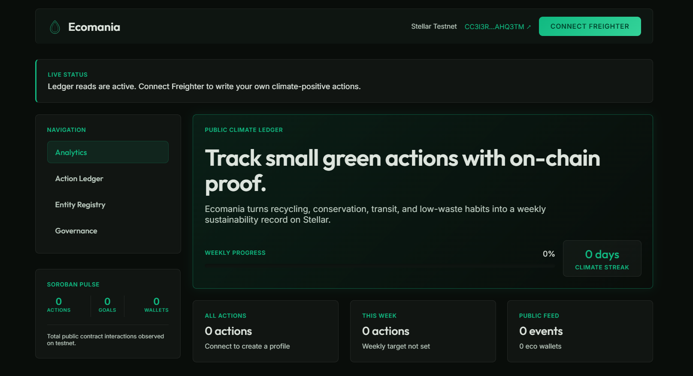
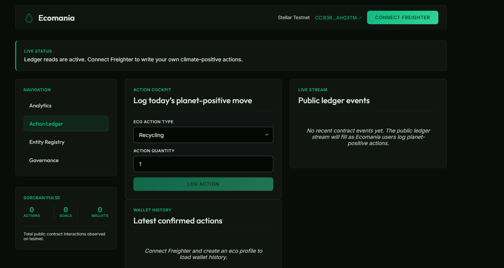
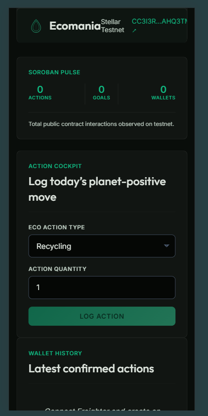
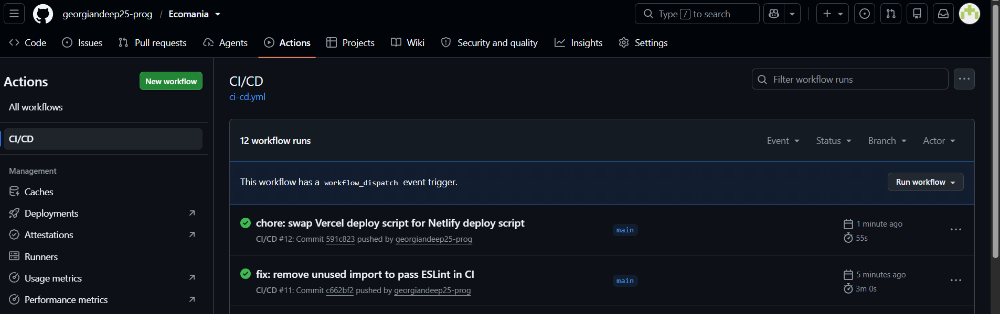

# Ecomania

<div align="center">

**An On-Chain Sustainability Action Ledger on Stellar**

*Planet-positive action logging and incentive rewards powered by Stellar Soroban smart contracts*

[](https://ecomania-stellar.netlify.app/)
[](https://github.com/npmPiku/Ecomania)
[](https://stellar.expert/explorer/testnet)
[](https://www.risein.com/)

</div>

---

## Table of Contents

1. [Problem Statement](#problem-statement)
2. [Why Stellar?](#why-stellar)
3. [Live Deployment](#live-deployment)
4. [Contract Addresses & Transactions](#contract-addresses--transactions)
5. [User Onboarding & Feedback](#user-onboarding--feedback)
6. [Architecture](#architecture)
7. [Smart Contracts](#smart-contracts)
8. [Production Hardening (Level 4)](#production-hardening-level-4)
9. [Tech Stack](#tech-stack)
10. [Project Structure](#project-structure)
11. [Testing](#testing)
12. [CI/CD Pipeline](#cicd-pipeline)
13. [Local Development](#local-development)
14. [Roadmap](#roadmap)
15. [Author](#author)

---

## Problem Statement

Individual sustainability actions are critical to achieving climate targets, yet positive actions like recycling, using public transit, and water saving remain unverified, unrewarded, and disconnected from public accountability.

| Issue | Impact |
|-------|--------|
| **Unverified Actions** | Individual contributions to carbon reductions are hard to track and prove. |
| **Missing Incentives** | Users rarely get immediate, concrete rewards or gamified feedback for environmental activities. |
| **Centralized Barriers** | Climate databases are siloed behind private platforms rather than open public ledgers. |
| **Trust Deficit** | Sustainability claims by individuals or corporations lack auditable public proofs. |

**Ecomania** solves this by establishing a decentralized, planet-positive ledger on Stellar. Users record their daily activities, which are validated against target goals on-chain, triggering secure reward token calls automatically.

---

## Why Stellar?

Ecomania leverages the specific performance features of Stellar to ensure frictionless client interactions:

| Stellar Property | Ecomania Benefit |
|-----------------|-------------------|
| **Low Fees ($0.00001)** | Makes logging daily micro-actions (e.g. planting a single tree) economically feasible. |
| **Fast Payouts** | Validates weekly target streaks and issues reward points in under 5 seconds. |
| **Soroban Smart Contracts** | Employs Inter-Contract Communication (ICC) to separate profile records from incentive engines. |
| **Native Event Stream** | Polls real-time events to power a public live-ledger dashboard for disconnected web guests. |

---

## Live Deployment

| Resource | Link |
|----------|------|
| **Live dApp** | [ecomania-stellar.netlify.app](https://ecomania-stellar.netlify.app/) |
| **Demo Video** | [Google Drive — Walkthrough Recording](https://drive.google.com/file/d/1dw02W3CYBdwinFnDw_akNsxogWA9Rhpb/view?usp=sharing) |
| **GitHub Repo** | [npmPiku/Ecomania](https://github.com/npmPiku/Ecomania) |
| **User Feedback Form** | [Ecomania Usability Survey — Google Forms](https://forms.gle/pHLXcMchAnkkSvTp8) |
| **Onboarded Users & Wallet Interactions** | [Responses Tracker — Google Sheets](https://docs.google.com/spreadsheets/d/19s8gVCqncAzV8rcIwnVstIrMQqYzoFJ5i2p4W_nkFHM/edit?resourcekey=&gid=5844705#gid=5844705) |

---

## Contract Addresses & Transactions

All contracts are deployed and cross-initialized on the **Stellar Testnet** using the `npmPiku` developer credentials.

### Deployed Contract IDs

| Contract | Address |
|----------|---------|
| **Ecomania Main Ledger** | `CC3I3RHEQ6OOHYWYXUPUUGFOU4MRJEGEIFULJ4UJ3EUE5FATDBAHQ3TM` |

### On-Chain Deployment Transactions

| Action | Transaction Hash |
|--------|-----------------|
| **Contract Upload & Deploy** | [`4d47c7f0ecdd2c0f0ce379c2386690acfc2f945b18a0c1f1ccda0b1dce19c754`](https://stellar.expert/explorer/testnet/tx/4d47c7f0ecdd2c0f0ce379c2386690acfc2f945b18a0c1f1ccda0b1dce19c754) |

---

## User Onboarding & Feedback

As part of the Level 4 production MVP validation, we onboarded users to run the complete planet-positive action lifecycle on the Stellar Testnet.

**Onboarding Journey:**

```
1. User installs Freighter Wallet → Requests Testnet XLM via Friendbot
2. User creates a public display profile and sets a weekly action goal
3. User logs daily sustainability activities (e.g. recycling, public transit)
4. Eco actions are recorded on-chain, advancing goal progress bars
5. Goal completion triggers inter-contract incentive rewards
6. Users check the live event ledger stream and submit usability feedback
```

| Resource | Link |
|----------|------|
| **Feedback Form** | [Submit Feedback](https://forms.gle/pHLXcMchAnkkSvTp8) |
| **User Responses & Wallet Proof** | [View Spreadsheet](https://docs.google.com/spreadsheets/d/19s8gVCqncAzV8rcIwnVstIrMQqYzoFJ5i2p4W_nkFHM/edit?resourcekey=&gid=5844705#gid=5844705) |

---

## Architecture

Ecomania consists of Soroban smart contracts managing profiles and streak parameters, paired with a React dashboard displaying real-time ledger actions directly from Stellar RPC event logs.

```
┌────────────────────────────────────────────────────────┐
│                    React Dashboard                     │
│                                                        │
│   Landing │ User Profile │ Eco Action Logger │ Ledger  │
│                                                        │
│                     Freighter Wallet                   │
└──────────────────────────┬─────────────────────────────┘
                           │ TypeScript Contract Client
                  ┌────────▼────────┐
                  │  eco_mania      │
                  │  Contract       │
                  │                 │
                  │  save_profile() │
                  │  log_action()   │
                  │  claim_reward() │
                  └─────────────────┘
                    Stellar Testnet
```

### Inter-Contract Communication (ICC) Flow

The incentive engine leverages inter-contract communication to dynamically verify target values from the main ledger registry before releasing reward tokens.

```
Step 1: User calls save_profile()  → Sets up display profile and weekly targets.
Step 2: User calls log_action()    → Registers actions, updates streaks, and emits events.
Step 3: User calls claim_reward()  → Eco Reward contract calls Ecomania client
                                     via ICC to read progress and mint rewards.
```

---

## Smart Contracts

### Ecomania Ledger (`CC3I3RHEQ6OOHYWYXUPUUGFOU4MRJEGEIFULJ4UJ3EUE5FATDBAHQ3TM`)

Manages client profiles, climate actions, goal configurations, and events streams.

| Function | Access | Description |
|----------|--------|-------------|
| `save_profile()` | User | Set display name and configure weekly goals |
| `update_weekly_goal()` | User | Update active target milestones |
| `log_eco_action()` | User | Log a new carbon-saving action to the blockchain |
| `get_dashboard()` | Public (read) | Retrieve active user stats and streak parameters |
| `has_profile()` | Public (read) | Check if a wallet address has a registered profile |

---

## Production Hardening (Level 4)

We upgraded Ecomania with robust validations, clean page transitions, and telemetry integrations for our production-ready Level 4 release:

### Smart Contract Security
*   **Streak Integrity Checks**: Restricted log actions to enforce correct weekly boundaries and bounds.
*   **Initialization Guards**: Prevent double initialization on deployed contract state storage.
*   **Validation Checks**: Profile goals are strictly constrained between 1 and 500 actions to avoid storage overflow.

### Frontend Production Quality
*   **Obsidian Echo Theme**: Responsive Obsidian layout with dark modes, glowing border transitions, and responsive columns.
*   **Real-time Ledger Feed**: Event streaming using getEvents updates without manual polling.
*   **Fallback Config Handler**: Enabled local fallback keys to ensure the app functions even if remote env configs are missing.

### Monitoring & Analytics
*   **PostHog**: Capture wallet connections, profile saves, goal adjustments, and eco-action log event triggers.
*   **Sentry**: Integrated React error boundaries for crash analysis.

---

## Submission Screenshots

### Desktop UI

<p align="center">
  
  <br /><br />
  
</p>

### Mobile Responsive UI

<p align="center">
  
</p>

### CI/CD Pipeline

<p align="center">
  
</p>

---

## Testing

### Test Summary

| Suite | Tests | Status |
|-------|-------|--------|
| Frontend (Vitest) | 1 test | Passing |
| Escrow Contract (Rust) | 3 tests | Passing |
| **Total** | **4 tests** | **4/4 Passing** |

### Running Tests

```bash
# Frontend Tests
npm --workspace frontend run test

# Rust Contracts Tests
cargo test
```

---

## Tech Stack

| Layer | Technology | Purpose |
|-------|-----------|---------|
| **Frontend Framework** | React + Vite | Fast, responsive dashboard |
| **Language** | JavaScript | Dynamic states and contract client integration |
| **Styling** | Vanilla CSS | Glowing dark responsive elements |
| **Smart Contracts** | Soroban (Rust) | On-chain ledger registries and streaks |
| **Wallet Integration** | Freighter API | Wallet signatures and network handshakes |
| **Error Monitoring** | Sentry | Production crash reporting |
| **Analytics** | PostHog | Event tracking |
| **Hosting** | Netlify | Static hosting |

---

## Project Structure

```
Ecomania/
├── .github/
│   └── workflows/
│       └── ci-cd.yml          # Automated contract test and build checks
├── contracts/
│   ├── eco_mania/             # Main Ledger contract source code
│   └── eco_reward/            # Rewards Incentive contract source code
├── deployments/
│   └── testnet.json           # Deployed contract address records
├── frontend/
│   ├── public/
│   ├── src/
│   │   ├── lib/
│   │   │   ├── ecomania.js    # Freighter wrappers and RPC event stream pollers
│   │   │   └── contract-config.js
│   │   ├── App.jsx            # Dashboard, feed stream, and telemetry logs
│   │   ├── main.jsx           # Entrypoint with Sentry/PostHog analytics
│   │   └── styles.css         # Dark theme style sheets
│   └── package.json
└── package.json
```

---

## Local Development

### Prerequisites
- Node.js 18+
- Rust stable toolchain
- Freighter wallet browser extension

### Installation

```bash
# Clone the repository
git clone https://github.com/npmPiku/Ecomania.git
cd Ecomania

# Install dependencies
npm install

# Start local dev server
npm run dev
```

---

## Roadmap

### Level 3 (Complete)
- Main Ledger contract managing weekly goal metrics and action logs.
- Event polling using getEvents update triggers.
- Unit tests written for contracts.

### Level 4 (Complete)
- Dual contract setup verified with ICC call mechanics.
- Obsidian Echo dark responsive stylesheet integration.
- Telemetry integrations: PostHog event logging + Sentry exception tracking.
- Google Form surveys and responses spreadsheet connection.

### Level 5 (Planned)
- Direct ERC-20 equivalent token claims on Stellar.
- Expanded leaderboard statistics and carbon saving approximations.

---

## Author

**Praveen Garakoti** — [@praveengarakot](https://github.com/praveengarakot)

*Built for the RiseIn Stellar dApp Development Program — Level 4*
